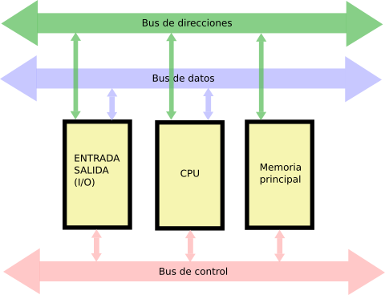

# Arquitecutra de Sistemas

Enrique Latorres
Presentaciones en [aulas](https://aulas.ort.edu.uy/course/view.php?id=1314) y en [su sitio web](latorres.ort/as). Contacto por teams o al 094421980

Evaluaciones

- Parcial 1: 25p
- Obligatorio: 35p
- Parcial 2: 40p

## Introducción, historia y evolución (del hardware en la computación)

Abaco chino (300 AC y 500 AC)
Sistemas mecánicos de encriptación (Cinta de cuero con caracteres)
En américa estaba el Quipu (Para memorizar y encriptar para los mensajeros)
Reglas de Cálculo (1600 DC)

### Generación Cero (1642, 1945) - Computadoras mecánicas

- Pascaline (1642)
- Leibniz (1671)
- Babbage (1801) Calculos de senos y cosenos de forma mecánica, creada por concurso para resolver relojes británicos. Después de tres iteraciones cada vez más ambiciosas llegó al computador
- Telares de Jacquard (1801) De aquí se toma la idea de las tarjetas perforadas
- Z1 (Calculadora binaria, mecánica de accionamiento eléctrico)
- Z3 (1941 - Primer máquina binaria del mundo, programable, usaba 2300 relés)
- Colossus
- Harvard Mark I (1944 - Primer familia de supercomputadores, de rayos de electrones)
- Tarjetas perforadas (1980 EEUU IBM crea estas máquinas para procesar resultados de censos)

### Primera generación (1940-1955): Tubos al vacío

Consumían mucho y se quemaban luego de un tiempo, además generaban mucho calor por lo que eran difíciles de mantener.

- ENIAC (1946)
- EDVAC (1949) Primera computadora electrónica con programa almacenado

### Segunda generación (1955 - 1965): Transistores y sistemazs de procesamiento por lotes

Esta generación baja mucho los costos y permite la utilización de los computadores por más tiempo antes de que se deban cambiar.

- IBM 704 (1956) Primer sistema operativo. Aritmética de punto flotante. Programable en FORTRAN (Antes se programaba en lenguaje de máquina)
- IBM 1401 (1959)
- PDP-1 (1959) Primera computadaora en la que se programó un juego. El Space War en el MIT (1962)

### Tercera generación (1965 - 1980): Circuitos integrados y multiprogramación

En un chip se colocan cientos de transistores.

- Intel 4004 de 4 bits (1970)
- Intel 8008 de 8 bits (1972)

### Cuarta generación (1980 -): Integración a muy gran escala

Primera PC con 8008

- Apple Computer (1975)
- Apple II (1981)
- IBM PC (1981) Sistema operativo PC-DOS, seleccionan a Intel para el microprocesador y a Microsoft para el OS
- Apple Lisa (1983) Primera PC con interfaz gráfica
- Apple Macintosh (1984)

### Un poco de arquitectura

## ?

> ¿Por qué los sistemas digitales son tan útiles y está tan extendido su uso?
> ¿Qué ventajas presentan sobre los sistemas analógicos?

En la realidad se presentan errores, interferencias y ruido, la entropía tiende a subir (2do principio de la termodinámica)

> ¿Cómo afecta esto a los sistemas analógicos y digitales?

Regeneración de la señal, es la clave del poder de los sistemas digitales. ¿Por qué parece importante?

- Los sistemas digitales pueden regenerar pero
- ¿Por qué es tan importante el sistema binario?
- ¿Por qué no otro cualquiera?

Discusión

- ¿Puedo construir sistemas con N estados usando varios sistemas que tengan solo dos estados?
- Si fuera posible, ¿Cuántos sistemas con dos estados necesito para construir uno con mil estados?

# La memoria y sus interfaces

La **Memoria** es una _tabla unidimensional de registros_.
Cada **Registro** puede guardar un numero en un cierto rango.
El **Bus de Dirección** indica con qué registro se va a operar. Los registros están numerados desde - hasta 2^n -1.
El **Bus de Control** indica la operación a realizar. Leer o Escribir.
El **Bus de Datos** es por donde se transmiten los datos (números) entre los registros de la memoria y los dispositivos

El Bus de datos tiene tantos cbles como el tamaño de los numeros que se quieren guardar.
No se deben hacer suposiciones sobre los valores que contiene una variable no inicializada, al encender un computador ya que los registros se inician con un numero fijo, aleatorio.
